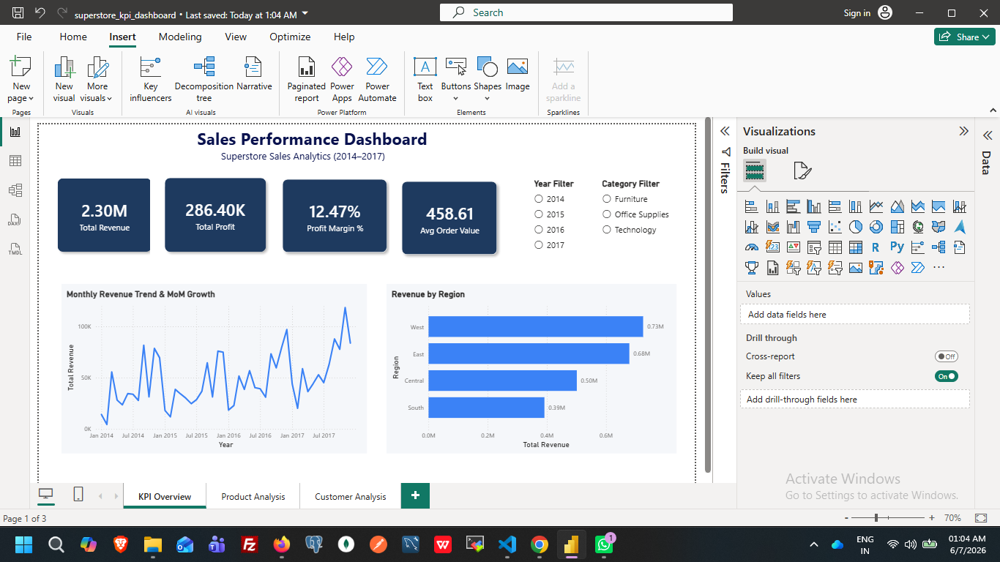
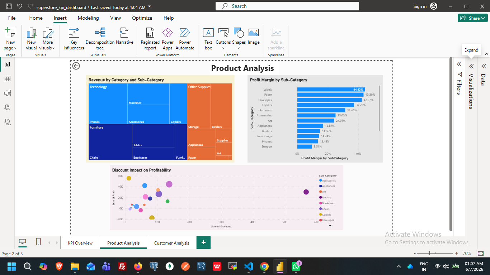
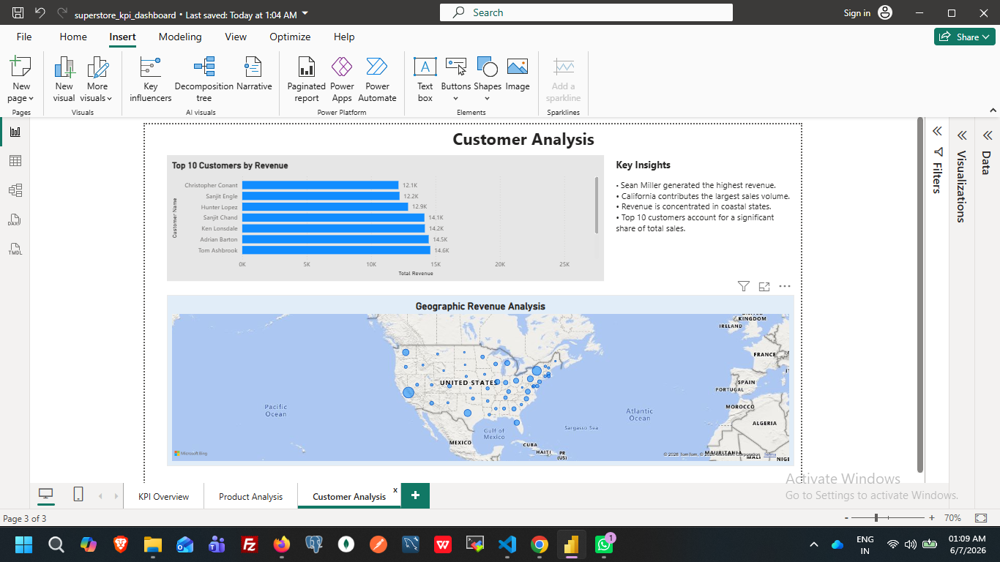

# Sales KPI Dashboard — Superstore Data


## Overview

This project analyzes the Superstore Sales dataset containing **9,994 orders** from **2014–2017**. It combines a Python-based ETL pipeline with interactive dashboards built in **Plotly Dash** and **Power BI** to generate business insights across revenue, profitability, customer performance, and product categories.

### Features

* Automated ETL pipeline using Python
* KPI computation and business metric generation
* Interactive Plotly Dash dashboard
* 3-page Power BI report with DAX measures
* Regional, product, and customer analysis
* Revenue trend and profitability monitoring

---

## Dashboard Pages

### Page 1 — KPI Overview

* Total Revenue
* Total Profit
* Profit Margin %
* Average Order Value
* Monthly Revenue Trend
* Revenue by Region
* Year and Category Filters

### Page 2 — Product Analysis

* Revenue by Category and Sub-Category
* Profit Margin by Sub-Category
* Discount vs Profit Analysis
* Product Performance Insights

### Page 3 — Customer Analysis

* Top 10 Customers by Revenue
* Geographic Revenue Distribution
* State-wise Sales Analysis

---


## Screenshots




## Power BI Report
Download and open:
```text
superstore_kpi_dashboard.pbix
```
using Power BI Desktop.

---

## Key Business Insights

* Total Revenue: **$2.30M**
* Total Profit: **$286.40K**
* Overall Profit Margin: **12.47%**
* Average Order Value: **$458.61**
* West Region generated the highest revenue (**$0.73M**)
* Labels achieved the highest profit margin (**44.42%**)
* Tables is a loss-making sub-category despite strong sales volume
* Revenue is concentrated in major coastal states such as California and New York
* Q4 seasonality is visible in monthly revenue trends
* Top customers contribute a significant share of overall revenue

---

## DAX Measures

```DAX
Total Revenue =
SUM('superstore'[Sales])

Total Profit =
SUM('superstore'[Profit])

Profit Margin % =
DIVIDE([Total Profit], [Total Revenue], 0) * 100

MoM Revenue Growth % =
VAR CurrentMonth = [Total Revenue]
VAR PrevMonth =
    CALCULATE(
        [Total Revenue],
        DATEADD('superstore'[Order Date], -1, MONTH)
    )
RETURN
    DIVIDE(CurrentMonth - PrevMonth, PrevMonth, 0) * 100

Avg Order Value =
DIVIDE(
    [Total Revenue],
    DISTINCTCOUNT('superstore'[Order ID]),
    0
)

Discount Impact =
SUMX(
    'superstore',
    'superstore'[Sales] * 'superstore'[Discount]
)
```

---

## Python KPI Processing

The ETL pipeline computes:

* Monthly Revenue Trends
* Month-over-Month Growth
* Revenue by Region
* Profit Margin by Category
* Sub-Category Performance
* Top Customers by Revenue
* Discount Impact Analysis
* Loss-Making Product Segments

---

## Project Structure

```text
sales-kpi-dashboard/
│
├── data/
│   └── superstore.csv
│   └── superstore_kpi_dashboard.pbix
│
├── screenshots/
│   ├── kpi_overview.png
│   ├── product_analysis.png
│   └── customer_analysis.png
│
├── src/
│   ├── etl.py
│   ├── kpis.py
│   └── utils.py
│
├── app.py
├── run.py
├── requirements.txt
├── README.md
└── .gitignore
```

---

## Installation

```bash
git clone <repository-url>
cd sales-kpi-dashboard

pip install -r requirements.txt
```

---

## Run Dashboard

```bash
python run.py
```

Open:

```text
http://localhost:8050
```

---

## Technologies Used

* Python 3.11
* Pandas
* Plotly Dash
* Power BI
* DAX
* ETL Processing

---

## Author

Tejaswi Denaboina

Built as a Data Analytics and Business Intelligence portfolio project using Python and Power BI.
